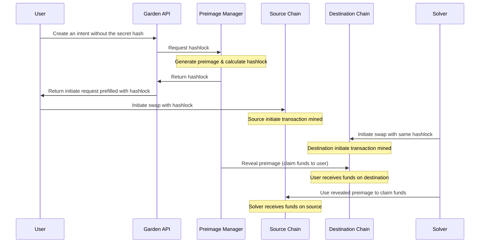

## Overview

This framework eliminates the need for users to stay online until the end of the swap, removing the need for the user side application to manually redeem on the destination chain.

<Tip>
We recommend using this system in state-less or unstable network environments, if you have access to persistent state and access to a background process consider managing the preimages on the user side. 
</Tip>

## How It Works

* This allows a user or an integrator to grant preimage manager access to generate the preimage, hold it until the solver initiate on the Destination chain.
* Revealing the preimage claims funds to user's address, the preimage manager is not allowed to change the addresses of sender or recipient as they are pre set onchain, and are immutable.
* This is an **optional** convinience feature, allowing the user to interact with the swapping system, and not stay online until confirmation, this could add high UX value for swaps from slow chains like Bitcoin.

### Architecture Overview

The diagram shows how the preimage manager eliminates the need for users to stay online throughout the entire swap process. Once the user initiates the swap on the source chain, the preimage manager handles the final redemption automatically when the solver completes their part of the atomic swap.