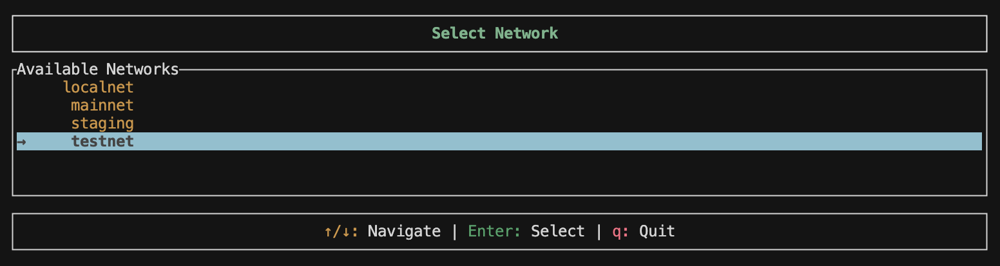
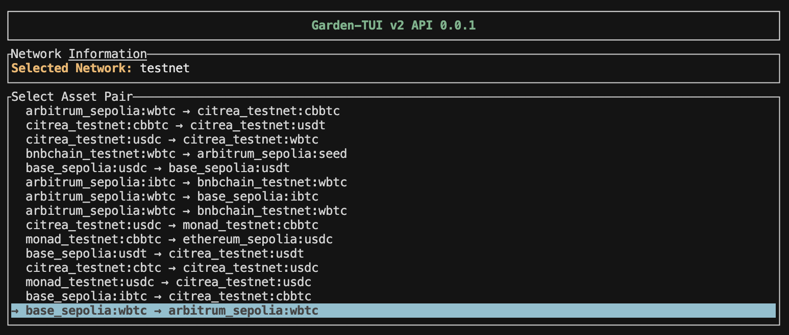
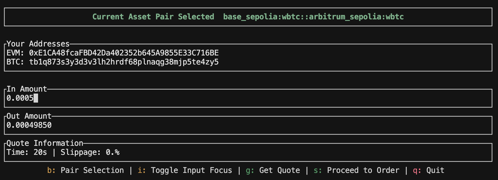
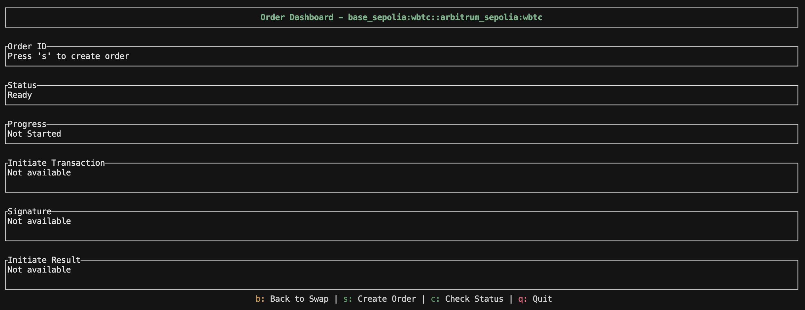
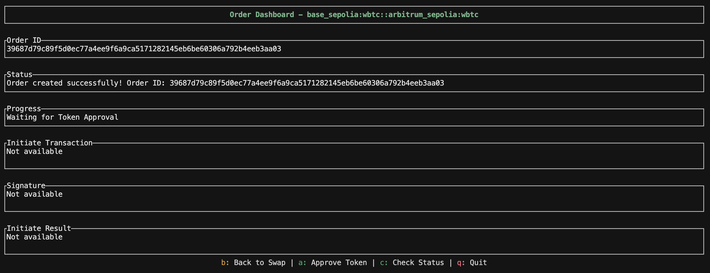
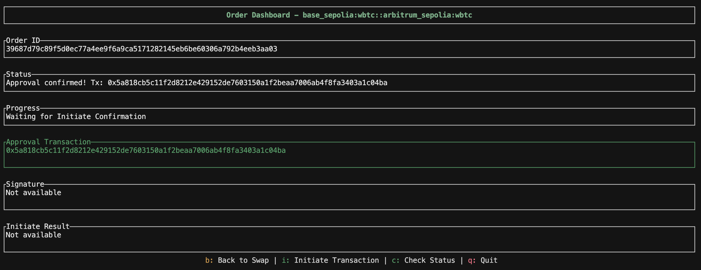
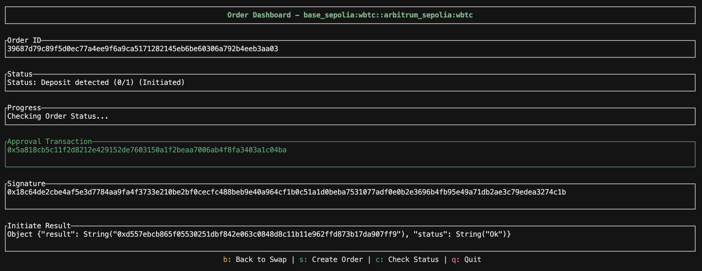
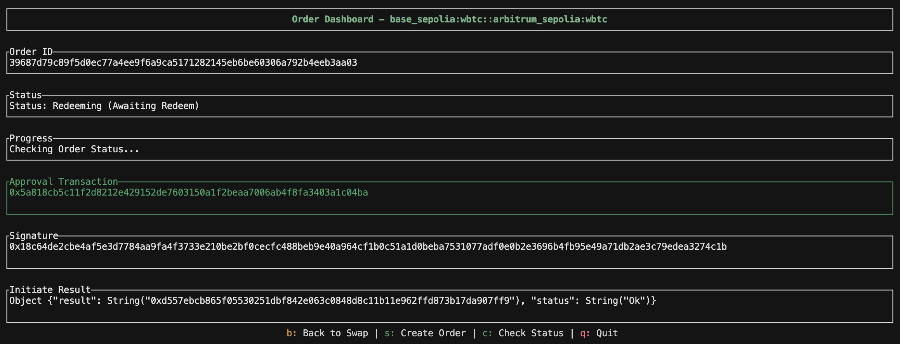
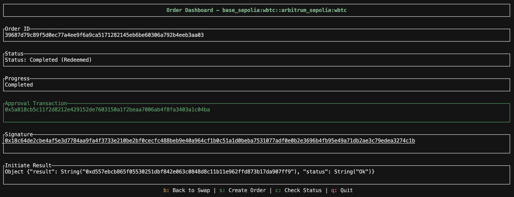

<Note>
If you are stuck at any part of the implementation, drop a message in our [Townhall](https://discord.gg/B7RczEFuJ5)—our dev team is ready to assist!
</Note>

This cookbook provides a step-by-step guide to building a terminal-based swap application using Garden's V2 API. It walks through creating an interactive TUI (Terminal User Interface) in Rust that enables seamless cross-chain swaps between Bitcoin and various EVM chains.

For a fully functional reference, check out [api-cookbook-demo](https://github.com/gardenfi/api-cookbook-demo), allowing you to see how these steps integrate into a working application.

<Frame caption="Terminal UI showing the network selection screen">
  
</Frame>

## What you'll build

- **Network selector**: Choose between localnet, testnet, or mainnet environments
- **Asset pair selector**: Browse and select from all available trading pairs
- **Quote dashboard**: Get real-time quotes with amount input
- **Order dashboard**: Create orders, initiate transactions, and track swap status

## Quick start

### Prerequisites

- Rust and Cargo installed
- Bitcoin and EVM private keys
- Access to Bitcoin and EVM networks (testnet for testing)

### Installation

Clone and set up the repository:

```bash
git clone https://github.com/gardenfi/api-cookbook-demo
cd api-cookbook-demo
```

### Configuration

**1. Set up environment variables**

Create a `.env` file with your private keys:

```bash
# EVM Private Key (hex format without 0x prefix)
PRIV_KEY=your_evm_private_key_here

# Bitcoin Private Key (WIF or hex format)
# If not provided, PRIV_KEY will be used
BTC_PRIV_KEY=your_btc_private_key_here
```

**2. Configure network endpoints**

The `config.json` file contains API endpoints and provider URLs for each network:

<CodeGroup>
```json Response expandable
{
  "networks": {
    "mainnet": {
      "api": {
        "assets_url": "https://api.garden.finance/v2/chains",
        "quote_server_url": "https://api.garden.finance/v2/quote",
        "authenticator_url": "https://api.garden.finance/auth",
        "orderbook_url": "https://api.garden.finance/v2/orders"
      },
      "providers": {
        "bitcoin": "https://mempool.space/api",
        "arbitrum": "https://arb-mainnet.g.alchemy.com/v2/demo",
        "ethereum": "https://eth-mainnet.g.alchemy.com/v2/demo"
      }
    },
    "testnet": {
      "api": {
        "assets_url": "https://testnet.api.garden.finance/v2/chains",
        "quote_server_url": "https://testnet.api.garden.finance/v2/quote",
        "authenticator_url": "https://testnet.api.garden.finance/auth",
        "orderbook_url": "https://testnet.api.garden.finance/v2/orders"
      },
      "providers": {
        "bitcoin": "https://mempool.space/testnet4/api",
        "arbitrum": "https://arbitrum-sepolia.drpc.org",
        "ethereum": "https://ethereum-sepolia-rpc.publicnode.com"
      }
    },
    "localnet": {
      "api": {
        "assets_url": "http://localhost:8080",
        "quote_server_url": "http://localhost:6969",
        "authenticator_url": "http://localhost:4427",
        "orderbook_url": "http://localhost:4455"
      },
      "providers": {
        "bitcoin": "http://localhost:30000",
        "arbitrum": "http://localhost:8546",
        "ethereum": "http://localhost:8545"
      }
    }
  }
}
```
</CodeGroup>

### Running the application

Start the terminal UI:

```bash
cargo run -- --c config.json
```

## Application flow

### 1. Network selection

When you launch the app, you'll first select your target network. The terminal interface presents all available networks (localnet, testnet, and mainnet) in an interactive list where you can navigate with arrow keys and select with Enter:

<Frame caption="Interactive network selector with localnet, testnet, and mainnet options">
  
</Frame>

The network selector is implemented in `src/ui/states/network_selector.rs`:

<CodeGroup>
```rust network_selector.rs
pub struct NetworkSelectorState {
    selected_index: usize,
    networks: Vec<String>,
    list_state: ListState,
}

impl NetworkSelectorState {
    pub fn new(config: &Config) -> Self {
        let mut networks: Vec<String> = config.networks.keys().map(|k| k.to_string()).collect();
        networks.sort();

        let mut list_state = ListState::default();
        list_state.select(Some(0));
        Self {
            selected_index: 0,
            networks,
            list_state,
        }
    }

    pub fn get_selected_network(&self) -> &str {
        &self.networks[self.selected_index]
    }

    fn update_list_state(&mut self) {
        self.list_state.select(Some(self.selected_index));
    }
}
```
</CodeGroup>

**Key features:**
- Navigate with `↑/↓` arrow keys
- Select with `Enter`
- Quit with `q`
- Scrollable list that adapts to terminal size

### 2. Fetching supported chains and assets

After selecting a network, the app fetches all available chains and their assets from Garden's API:

<CodeGroup>
```rust chains.rs
pub fn get_chains(&self) -> Result<Vec<Chain>> {
    let response = self
        .client
        .get(&self.assets_url)
        .send()
        .map_err(|e| anyhow!("Failed to fetch chains: {}", e))?;

    let response_text = response
        .error_for_status()
        .map_err(|e| anyhow!("HTTP error: {}", e))?
        .text()
        .map_err(|e| anyhow!("Failed to read response body: {}", e))?;

    let api_response: ApiResponse<Vec<Chain>> = serde_json::from_str(&response_text)
        .map_err(|e| anyhow!("Failed to parse chains response: {}", e))?;

    Ok(api_response.result)
}
```
</CodeGroup>

**Response structure:**

```json Response expandable
{
  "status": "Ok",
  "result": [
    {
      "chain": "bitcoin_testnet",
      "id": "bitcoin",
      "icon": "https://garden.imgix.net/token-images/bitcoin.svg",
      "explorer_url": "https://mempool.space/testnet4",
      "confirmation_target": 1,
      "source_timelock": "144",
      "destination_timelock": "12",
      "supported_htlc_schemas": [],
      "supported_token_schemas": [],
      "assets": [
        {
          "id": "bitcoin_testnet:btc",
          "name": "Bitcoin",
          "chain": "bitcoin",
          "icon": "https://garden.imgix.net/token-images/bitcoin.svg",
          "htlc": null,
          "token": null,
          "decimals": 8,
          "min_amount": "50000",
          "max_amount": "10000000000",
          "price": 114641.1
        }
      ]
    },
    {
      "chain": "ethereum_sepolia",
      "id": "evm:11155111",
      "icon": "https://garden.imgix.net/chain_images/sepolia.svg",
      "explorer_url": "https://sepolia.etherscan.io",
      "confirmation_target": 1,
      "source_timelock": "7200",
      "destination_timelock": "600",
      "supported_htlc_schemas": [
        "evm:htlc_erc20"
      ],
      "supported_token_schemas": [
        "evm:erc20"
      ],
      "assets": [
        {
          "id": "ethereum_sepolia:wbtc",
          "name": "Wrapped Bitcoin",
          "chain": "evm:11155111",
          "icon": "https://garden.imgix.net/token-images/wbtc.svg",
          "htlc": {
            "address": "0xd1E0Ba2b165726b3a6051b765d4564d030FDcf50",
            "schema": "evm:htlc_erc20"
          },
          "token": {
            "address": "0xE918A5a47b8e0AFAC2382bC5D1e981613e63fB07",
            "schema": "evm:erc20"
          },
          "decimals": 8,
          "min_amount": "50000",
          "max_amount": "10000000000",
          "price": 114641.1
        },
        {
          "id": "ethereum_sepolia:usdc",
          "name": "USD Coin",
          "chain": "evm:11155111",
          "icon": "https://garden.imgix.net/token-images/usdc.svg",
          "htlc": {
            "address": "0x730Be401ef981D199a0560C87DfdDaFd3EC1C493",
            "schema": "evm:htlc_erc20"
          },
          "token": {
            "address": "0xadDD620EA6D20f4f9c24fff3BC039E497ceBEDc2",
            "schema": "evm:erc20"
          },
          "decimals": 6,
          "min_amount": "15000000",
          "max_amount": "10000000000",
          "price": 1
        }
      ]
    }
  ]
}
```

### 3. Asset pair selection

The app generates all possible trading pairs and displays them in an interactive scrollable list. Browse through available swap routes showing the source and destination assets with their respective chains:

<Frame caption="Scrollable list of available trading pairs between different chains">
  
</Frame>

<CodeGroup>
```rust network_information.rs
pub fn generate_asset_pairs(chains: Vec<Chain>) -> Vec<AssetPair> {
    let mut assets = Vec::new();

    for chain in chains {
        for asset in chain.assets {
            if asset.price.unwrap_or(0.0) > 0.0 {
                assets.push(asset.id);
            }
        }
    }

    let mut pairs = Vec::new();
    for i in 0..assets.len() {
        for j in 0..assets.len() {
            if i != j {
                pairs.push(AssetPair::new(assets[i].clone(), assets[j].clone()));
            }
        }
    }

    pairs
}
```
</CodeGroup>

**Key features:**
- Automatic pair generation from chain data
- Scrollable list with visual indicators
- Back navigation to network selection
- Search and filter capabilities

### 4. Getting quotes

Once you select a pair, enter an amount and press "g" to get a real-time quote. The swap page displays the selected asset pair and allows you to input the amount you want to swap:

<Frame caption="Swap page with amount input for the selected trading pair">
  
</Frame>

After submitting the amount, the application fetches real-time quotes from available solvers and displays detailed swap information including estimated output, fees, and execution time. Press "s" to proceed with creating the order:

<Frame caption="Quote received, ready to create order">
  
</Frame>

<CodeGroup>
```rust quote.rs
pub async fn fetch_quote(
    context: &ApiContext,
    from: &str,
    to: &str,
    from_amount: &str,
) -> Result<Vec<Quote>> {
    let url = format!(
        "{}/v2/quote?from={}&to={}&from_amount={}",
        context.base_url, from, to, from_amount
    );
    
    let response = reqwest::Client::new()
        .get(&url)
        .header("garden-app-id", &context.app_id)
        .header("accept", "application/json")
        .send()
        .await?;
    
    let quote_response: QuoteResponse = response.json().await?;
    Ok(quote_response.result)
}
```
</CodeGroup>

**Quote response:**

```json
{
  "status": "Ok",
  "result": [
    {
      "source": {
        "asset": "bitcoin_testnet:btc",
        "amount": "50000",
        "display": "0.00050000",
        "value": "58.82"
      },
      "destination": {
        "asset": "base_sepolia:wbtc",
        "amount": "49850",
        "display": "0.00049850",
        "value": "58.64"
      },
      "solver_id": "0x9dd9c2d208b07bf9a4ef9ca311f36d7185749635",
      "estimated_time": 20,
      "slippage": 0,
      "fee": 30,
      "fixed_fee": "0"
    }
  ]
}
```

### 5. Creating orders

After confirming the quote, the application creates an order on Garden's orderbook. You'll see the order being processed with all the swap details:

<Frame caption="Order successfully created showing order ID and swap details">
  
</Frame>

For EVM source swaps, you'll need to approve token spending before initiating the swap. The application will prompt you to sign the approval transaction by clicking "a":

<Frame caption="Token approved screen for EVM chains">
  
</Frame>

<CodeGroup>
```rust orders.rs
pub async fn create_order(
    context: &ApiContext,
    request: CreateOrderRequest,
) -> Result<OrderResponse> {
    let url = format!("{}/v2/orders", context.base_url);
    
    let response = reqwest::Client::new()
        .post(&url)
        .header("garden-app-id", &context.app_id)
        .header("Content-Type", "application/json")
        .json(&request)
        .send()
        .await?;
    
    let order_response: OrderCreationResponse = response.json().await?;
    Ok(order_response.result)
}
```
</CodeGroup>

**Order creation request:**

```json
{
  "source": {
    "asset": "bitcoin_testnet:btc",
    "owner": "tb1p4pr78swsn60y4ushe05v28mqpqppxxkfkxu2wun5jw6duc8unj3sjrh4gd",
    "amount": "50000"
  },
  "destination": {
    "asset": "base_sepolia:wbtc",
    "owner": "0x004Cc75ACF4132Fc08cB6a252E767804F303F729",
    "amount": "49850"
  }
}
```

### 6. Initiating transactions

The initiation process differs based on the source chain. After creating an order and approving tokens (for EVM), you'll see the initiation screen with transaction details ready to be signed and broadcast:

<Frame caption="Transaction initiation screen showing the swap details">
  
</Frame>

#### Bitcoin Initiation

For Bitcoin swaps, construct and broadcast a transaction to the HTLC address:

<CodeGroup>
```rust expandable htlc_handler.rs
pub fn initiate_htlc(
    &self,
    private_key: PrivateKey,
    htlc_addr: bitcoin::Address,
    amount: i64,
) -> Result<Transaction> {
    let public_key = PublicKey::from_private_key(&self.secp, &private_key);
    let compressed_pubkey = CompressedPublicKey::try_from(public_key).unwrap();
    let sender_address = Address::p2wpkh(&compressed_pubkey, self.network);

    let runtime = tokio::runtime::Runtime::new()
        .map_err(|e| anyhow!("Unable to create runtime: {}", e))?;

    let utxos = runtime.block_on(
        self.indexer
            .get_utxos_for_amount(&sender_address.to_string(), amount),
    )?;

    let mut inputs: Vec<TxIn> = Vec::new();
    let mut input_values: Vec<u64> = Vec::new();
    for utxo in utxos {
        let txid = Txid::from_str(&utxo.txid)?;
        inputs.push(TxIn {
            previous_output: OutPoint {
                txid,
                vout: utxo.vout,
            },
            script_sig: ScriptBuf::new(),
            sequence: Sequence::ENABLE_RBF_NO_LOCKTIME,
            witness: Witness::new(),
        });
        input_values.push(utxo.value);
    }

    let fee = 250 * inputs.len() as u64;
    let total_input: u64 = input_values.iter().sum();

    let output = TxOut {
        value: Amount::from_sat(amount as u64),
        script_pubkey: htlc_addr.script_pubkey(),
    };

    let mut outputs = vec![output];

    if total_input > (amount as u64 + fee) {
        outputs.push(TxOut {
            value: Amount::from_sat(total_input - amount as u64 - fee),
            script_pubkey: sender_address.script_pubkey(),
        });
    }

    let mut unsigned_tx = Transaction {
        version: Version::TWO,
        lock_time: LockTime::ZERO,
        input: inputs,
        output: outputs,
    };

    let mut sighash_cache = SighashCache::new(&mut unsigned_tx);

    for i in 0..input_values.len() {
        let script_pubkey = ScriptBuf::new_p2wpkh(&public_key.wpubkey_hash()?);
        let sighash_type = EcdsaSighashType::All;
        let sighash = sighash_cache.p2wpkh_signature_hash(
            i,
            &script_pubkey,
            Amount::from_sat(input_values[i]),
            sighash_type,
        )?;

        let msg = Message::from(sighash);
        let signature = self.secp.sign_ecdsa(&msg, &private_key.inner);

        let btc_signature = bitcoin::ecdsa::Signature {
            signature,
            sighash_type,
        };
        let pubkey_bytes = public_key.to_bytes();
        *sighash_cache.witness_mut(i).unwrap() = Witness::p2wpkh(
            &btc_signature,
            &bitcoin::secp256k1::PublicKey::from_slice(&pubkey_bytes)?,
        )
    }

    let signed_tx = sighash_cache.into_transaction();

    Ok(signed_tx.clone())
}
```
</CodeGroup>

#### EVM Initiation

For EVM chains, sign EIP-712 typed data and submit to the relayer:

<CodeGroup>
```rust expandable order/evm.rs
// Sign EIP-712 message
match sign_order_typed_data(&typed_data, &context.wallet.signer) {
    Ok(signature) => {
        self.signature = Some(signature.clone());

        // Start initiate process
        self.progress = OrderProgress::InitiatingTransaction;
        self.set_status("Initiating transaction...".to_string());

        // Send signature to initiate endpoint
        match context
            .api
            .orders
            .initiate_order(&order_response.order_id, &signature)
        {
            Ok(result) => {
                self.initiate_result = Some(format!("{result:?}"));
                self.set_status(
                    "Transaction initiated successfully!\nFetching order status..."
                        .to_string(),
                );
                // Fetch actual order status from API
                self.fetch_order_status(context);
            }
            Err(e) => {
                self.progress = OrderProgress::Failed(e.to_string());
                self.set_status(format!("Initiation failed: {e}"));
            }
        }
    }
    Err(e) => {
        self.progress = OrderProgress::Failed(e.to_string());
        self.set_status(format!("Signing failed: {e}"));
    }
}
```
</CodeGroup>

### 7. Tracking order status

Monitor your swap progress in real-time. The order status screen displays detailed information about your swap including transaction hashes, swap amounts, and the current state:

<Frame caption="Order tracking showing swap progress and transaction details">
  
</Frame>

The status dashboard provides comprehensive information including:
- Current order status (Created, Initiated, Awaiting Redeem, Redeemed)
- Swap amounts and asset details
- Real-time status updates

Once the swap completes successfully, you'll see the final status with all transaction details confirmed:

<Frame caption="Completed swap showing successful redemption">
  
</Frame>

<CodeGroup>
```rust order/actions.rs
pub(super) fn fetch_order_status(&mut self, context: &mut AppContext) {
    if let Some(order_id) = context.order.current_order_id.clone() {
        match context.api.orders.get_order_details(&order_id) {
            Ok(order_status) => {
                self.order_id = order_status.order_id.clone();

                let parsed_status = parse_order_status(&order_status);
                let status_label = get_order_status_label(parsed_status);

                let status_msg = format!(
                    "Status: {} ({})\nOrder ID: {}\nSource: {} {}\nDest: {} {}\nCreated: {}{}{}",
                    status_label.as_str(),
                    parsed_status.as_str(),
                    order_status.order_id,
                    order_status.source_swap.amount,
                    order_status.source_swap.asset,
                    order_status.destination_swap.amount,
                    order_status.destination_swap.asset,
                    order_status.created_at,
                    if !order_status.source_swap.initiate_tx_hash.is_empty() { format!("\nInitiate Tx: {}", order_status.source_swap.initiate_tx_hash) } else { String::new() },
                    if order_status.source_swap.current_confirmations > 0 { format!("\nConfirmations: {}/{}", order_status.source_swap.current_confirmations, order_status.source_swap.required_confirmations) } else { String::new() }
                );

                match parsed_status.as_str() {
                    "Redeemed" | "Refunded" => {
                        self.set_status(status_msg);
                        self.progress = OrderProgress::Completed;
                    }
                    "Expired" => {
                        self.set_status(status_msg);
                        self.progress = OrderProgress::Failed("Order expired".to_string());
                    }
                    "Created" => {
                        self.update_action_status(&status_msg);
                    }
                    _ => {
                        if order_status.source_swap.initiate_tx_hash.is_empty() {
                            self.update_action_status(&status_msg);
                        } else {
                            self.set_status(status_msg);
                            self.progress = OrderProgress::CheckingStatus;
                        }
                    }
                }
            }
            Err(e) => {
                self.set_status(format!("Failed to fetch order status: {e}"));
            }
        }
    }
}
```
</CodeGroup>

**Order status progression:**

1. **Created** - Order submitted to orderbook
2. **Initiate Detected** - User's deposit transaction detected
3. **Initiated** - Deposit confirmed on source chain
4. **Awaiting Redeem** - Solver has filled on destination chain
5. **Redeem Detected** - Redemption transaction detected
6. **Redeemed** - Swap completed successfully

The status parser (`src/service/garden/status.rs`) implements the complete logic:

<CodeGroup>
```rust status.rs
pub fn parse_order_status(order: &OrderDetails) -> OrderStatusEnum {
    // Check for redemption
    if !order.destination_swap.redeem_tx_hash.is_empty() {
        if order.destination_swap.redeem_block_number != "0" {
            return OrderStatusEnum::Redeemed;
        }
        return if is_bitcoin(&order.destination_swap.chain) {
            OrderStatusEnum::Redeemed
        } else {
            OrderStatusEnum::RedeemDetected
        };
    }
    
    // Check for refund
    if !order.source_swap.refund_tx_hash.is_empty() {
        if order.source_swap.refund_block_number != "0" {
            return OrderStatusEnum::Refunded;
        }
        return OrderStatusEnum::RefundDetected;
    }
    
    // Check for initiation
    if !order.destination_swap.initiate_tx_hash.is_empty() {
        return OrderStatusEnum::AwaitingRedeem;
    }
    
    if !order.source_swap.initiate_tx_hash.is_empty() {
        if order.source_swap.initiate_block_number != "0" {
            return OrderStatusEnum::Initiated;
        }
        return OrderStatusEnum::InitiateDetected;
    }
    
    OrderStatusEnum::Created
}
```
</CodeGroup>

## Key implementation details

### Bitcoin HTLC construction

The app includes a complete Bitcoin HTLC handler (`src/service/blockchain/bitcoin/htlc_handler.rs`) that:

- Fetches UTXOs from Bitcoin indexers
- Constructs P2WPKH transactions
- Signs with Schnorr signatures
- Broadcasts to the network
- Handles Taproot script paths

### EIP-712 signing

For EVM chains, the app uses Alloy to sign typed data:

<CodeGroup>
```rust expandable context.rs
use alloy::signers::local::PrivateKeySigner;

pub struct WalletContext {
    pub signer: LocalSigner<SigningKey>,
    pub btc_private_key: bitcoin::PrivateKey,
    pub btc_address: String,
    pub provider_urls: HashMap<String, String>,
}

impl WalletContext {
    fn new(network: &str, provider_urls: HashMap<String, String>) -> WalletContext {
        let eth_priv_key = env::var("PRIV_KEY").expect("please provide a valid PRIV_KEY in env");
        let btc_priv_key = env::var("BTC_PRIV_KEY").unwrap_or(eth_priv_key.clone());

        let signer = PrivateKeySigner::from_str(&eth_priv_key).expect("ERR CREATING ETH SIGNER");
        let btc_network = match network {
            "mainnet" => bitcoin::Network::Bitcoin,
            "testnet" => bitcoin::Network::Testnet4,
            _ => bitcoin::Network::Regtest,
        };

        let btc_private_key = if btc_priv_key.len() == 64 {
            let priv_key_bytes = hex::decode(&btc_priv_key).unwrap();
            PrivateKey::from_slice(&priv_key_bytes, btc_network).unwrap()
        } else {
            PrivateKey::from_wif(&btc_priv_key).unwrap()
        };
        let secp = Secp256k1::new();
        let pubkey = PublicKey::from_private_key(&secp, &btc_private_key);
        let btc_pubkey = CompressedPublicKey::try_from(pubkey).unwrap();
        let btc_address = Address::p2wpkh(&btc_pubkey, btc_network).to_string();

        Self {
            signer,
            btc_network,
            btc_private_key,
            btc_address,
            provider_urls,
        }
    }
}
```
</CodeGroup>

### TUI architecture

The terminal UI is built with `ratatui` and follows a state machine pattern:

```
NetworkSelector → AssetSelector → SwapInformation → CreateOrder → OrderDashboard
       ↑                 ↓                 ↓                ↓                ↓
       └──────────┴───────────┴─────────┴──────────┘
                                  (back navigation)
```

Each state implements the `State` trait:

<CodeGroup>
```rust mod.rs
pub trait State {
    fn draw(&mut self, f: &mut Frame, context: Option<&AppContext>);
    fn handle_key(&mut self, key: KeyEvent, context: Option<&AppContext>) 
        -> Result<Option<StateType>>;
    fn as_any(&self) -> &dyn Any;
}
```
</CodeGroup>

## API reference

The app demonstrates usage of Garden's V2 API:

| Endpoint | Purpose |
|----------|---------|
| `GET /v2/chains` | Fetch all supported chains and assets |
| `GET /v2/quote` | Get real-time swap quotes |
| `POST /v2/orders` | Create a new swap order |
| `POST /v2/orders/{id}?action=initiate` | Submit EVM initiation signature |
| `GET /v2/orders/{id}` | Check order status |

All API calls include:
- `garden-app-id` header for authentication
- `accept: application/json` header
- Proper error handling with `anyhow::Result`

<Check>
  You now have a complete reference implementation for building cross-chain swap applications using Garden's V2 API!
</Check>

## Next steps

By exploring this cookbook, you've seen how to build a production-ready swap application. Consider extending it with:

- **Multi-order management** to track multiple swaps simultaneously
- **Web interface** using the same backend logic
- **Advanced Bitcoin features** like RBF and CPFP
- **Order history persistence** with a database
- **Affiliate fee integration** for monetization

<CardGroup cols={2}>
  <Card title="API Reference" href="/api-reference/quickstart">
    View complete V2 API documentation
  </Card>
  <Card title="GitHub Repository" href="https://github.com/gardenfi/api-cookbook-demo">
    Explore the full source code
  </Card>
</CardGroup>
